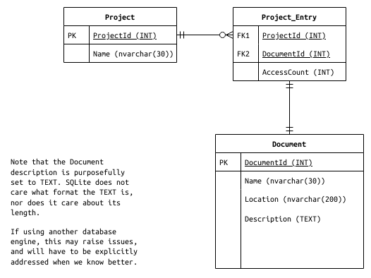

# SQLite

The schema is as follows:

Note that in the `Document` table, `Description` is purposefully set to the
`TEXT` type. SQLite does not care what format the text is in, nor does it care
about its length.

If using another database engine, this may raise issues, and will have to be
explicitly adressed, when we'll know better.

In the `Project` table, although it is tempting to use the name as a primary
key, it is not used so, as a project may be renamed.
